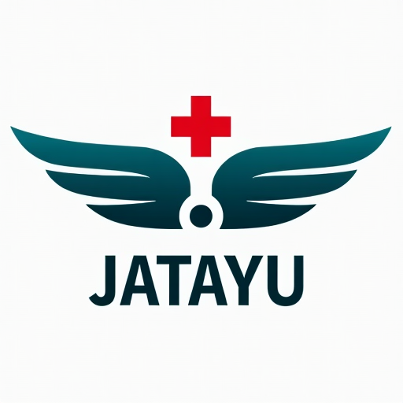
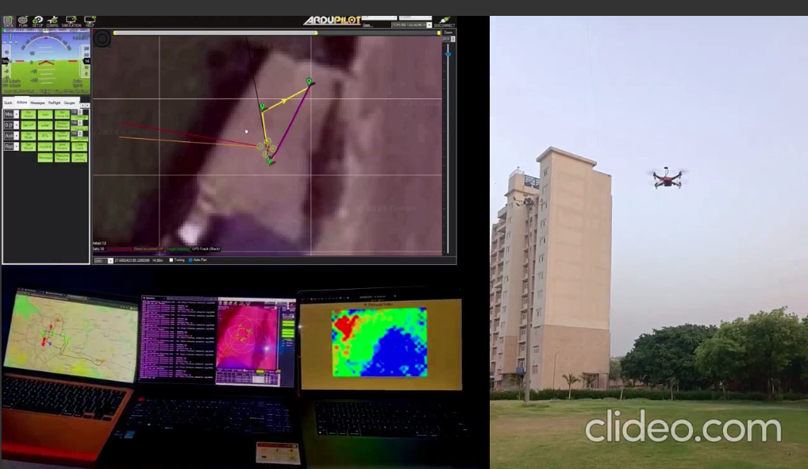
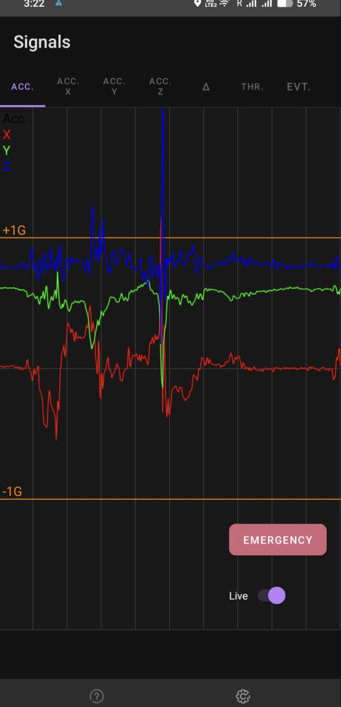
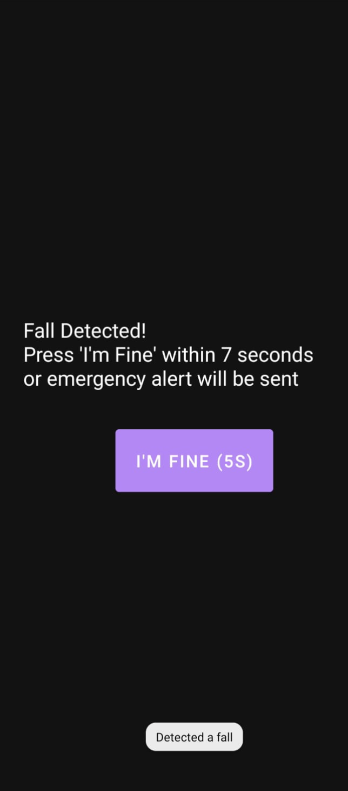

# JATAYU 

**Jatayu** is an integrated **emergency healthcare response system** designed to provide efficient and streamlined medical crisis management through a connected web platform. The system connects patients, responders, drones, and AI in real-time to ensure immediate detection, location mapping, medical support delivery, and injury classification during health-related emergencies.

---

---

## 1. Patient-Centric Event Detection App

The *Event Detection App* is the frontline interface in **Jatayu’s medical emergency workflow**, ensuring rapid detection of critical health incidents.  
 

### Healthcare Features:
- **Fall Detection for Elderly & At-risk Patients**:
  - If a fall is detected, the device begins *beeping for 7 seconds*.
  - If the patient *responds*, the alert is canceled.
  - If there’s *no response*:
    - The app instantly sends the *GPS location* to the healthcare dashboard.
    - *Calls and messages* are triggered to the patient’s emergency contacts or healthcare providers.

- **Manual Health Emergency Trigger**:
  - Patients can manually request help for sudden health conditions (e.g., heart attack, seizures) via the app.

---

## 2. Real-Time Medical Mapping

Upon receiving a medical alert, the *Mapping Section* activates to visualize health emergencies on a map.

### Features:
1. **Live GPS Tracking**:
   - Accurately maps the patient’s location for responders.
2. **Population Density Thresholding**:
   - In high-density areas (e.g., hospitals, elderly care homes):
     - **Below threshold**: Standard emergency protocols are initiated.
     - **Above threshold**: Drone-based delivery and AI support are deployed for large-scale triage.

---

## 3. Drone-Powered Medical Response

Jatayu’s Drone Section ensures rapid delivery of medical aid and site assessment when ground response is delayed or limited.

### Functions:
1. **Autonomous Navigation**: Drones are deployed directly to patient locations.
2. **Medical Payload Delivery**: Supplies such as first-aid kits, oxygen, or essential medicines are dropped.
3. **Aerial Imaging for Triage**: Provides a visual overview of mass casualty or remote patient scenarios.
4. **Drone-Based Patient Assessment**: Equipped with sensors and cameras to assist in remote vitals monitoring and situational analysis.

---

## 4. AI-Driven Health Triage and Injury Detection

The *AI Section* intelligently analyzes drone feeds and mapping data to prioritize medical emergencies.

### Healthcare Features:
- **Human Presence Estimation**: Assesses the number of people affected.
- **Injury & Condition Detection**: Uses image recognition to classify medical urgency:
  - *a. Normal* (minor injuries, low risk)
  - *b. Intermediate* (needs medical attention)
  - *c. Severe* (life-threatening, needs immediate help)
- **Triage Heatmaps**: Highlights areas requiring urgent medical care.
- **Ambulance Routing**: AI calculates and suggests *shortest paths* for emergency medical teams.
- **Hospital & Government Alerts**: Notifies hospitals, clinics, and health departments for coordinated response and resource allocation.

---

## 5. Central Healthcare Dashboard (Website Integration)

The Jatayu website acts as the **central healthcare command center**.

### Key Features:
- **Real-Time Emergency Monitoring**: Tracks all live patient incidents and responder activity.
- **Visual Health Mapping**: Interactive maps showing injury hotspots, drone positions, and priority zones.
- **Resource Coordination**: Manages hospital beds, ambulances, and medical staff availability.
- **Alerts & Communication**: Sends automated notifications to doctors, responders, and healthcare authorities.
- **Data-Driven Decisions**: Uses AI insights to guide triage, transportation, and patient prioritization.

---

**Jatayu**: Revolutionizing healthcare emergency response with innovation, intelligence, and integration.
